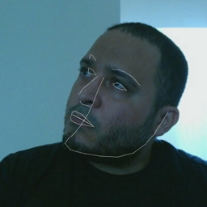
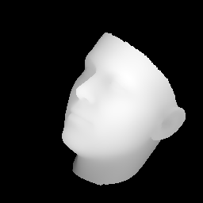
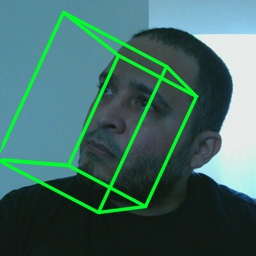
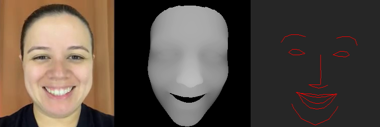
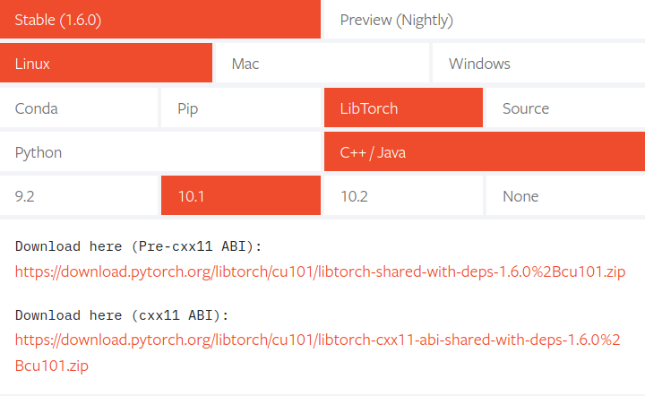

# Simbotic Torch
### LibTorch plugin for GStreamer in Rust









Not only are the networks CUDA-enabled, but the pipeline has also been accelerated with CUDA tensors.

Source for:
- [Monocular Depth](src/monodepth.rs)
- [Semantic Segmentation](src/semseg.rs)
- [Motion Transfer](src/motiontransfer.rs)

## Dependencies

SimboticTorch has been tested on Ubuntu 18/20.

#### Rust
Works with latest stable [Rust](https://rustup.rs/)

#### CUDA 10.1 + cuDNN
Make sure you have CUDA 10.1 installed in your system with latest cuDNN.

Download cuDNN v7.6.5 (November 5th, 2019), for CUDA 10.1:
- cuDNN Runtime Library for Ubuntu18.04 (Deb)
- cuDNN Developer Library for Ubuntu18.04 (Deb)

#### LibTorch 1.5.1
Depends on CUDA(10.1)-enabled LibTorch:

- Get `libtorch` from the
  - [PyTorch website download section](https://pytorch.org/get-started/locally/)
  - Specifically [cxxx11 ABI](https://download.pytorch.org/libtorch/cu101/libtorch-cxx11-abi-shared-with-deps-1.5.1%2Bcu101.zip)
- Set env `$LIBTORCH`



#### GStreamer
Depends on GStreamer development libraries:
```
apt install libgstreamer1.0-dev libgstreamer-plugins-base1.0-dev \
    gstreamer1.0-plugins-base gstreamer1.0-plugins-good \
    gstreamer1.0-plugins-bad gstreamer1.0-plugins-ugly \
    gstreamer1.0-libav libgstrtspserver-1.0-dev
```

#### Misc dependencies
SimboticTorch now includes a 3D rendering engine, and has the following dependencies:
```
apt install glslang-tools
```

Others:
```
apt install libssl-dev
```

## Build

### Git LFS
This repo uses Git LFS for models and assets. Make sure `git lfs` command is properly [installed](https://git-lfs.github.com/).

### Environment variable:

An environment variable needs to be set for all scripts and tools to be able to find this plugin.

```
export SIMBOTIC_TORCH=/full/path/to/this/repo
```

### Building:

To build the rust gst plugin, just type:

```
./build.sh
```

### Test Monodepth and Segmentation with any of the following:
```
./test_dashboard_preview.sh
./test_dashboard_webcam.sh
./test_dashboard_file.sh

./test_monodepth_preview.sh
./test_monodepth_webcam.sh

./test_semseg_preview.sh
./test_semseg_webcam.sh
```

### Test Motion Transfer:

```
./test_motiontransfer_preview.sh
./test_motiontransfer_webcam.sh
./test_motiontransfer_file.sh
```

----------------------

## Citations


```
@article{monodepth2,
  title     = {Digging into Self-Supervised Monocular Depth Prediction},
  author    = {Cl{\'{e}}ment Godard and
               Oisin {Mac Aodha} and
               Michael Firman and
               Gabriel J. Brostow},
  booktitle = {The International Conference on Computer Vision (ICCV)},
  month = {October},
year = {2019}
}
```
```
@inproceedings{semantic_cvpr19,
  author       = {Yi Zhu*, Karan Sapra*, Fitsum A. Reda, Kevin J. Shih, Shawn Newsam, Andrew Tao, Bryan Catanzaro},
  title        = {Improving Semantic Segmentation via Video Propagation and Label Relaxation},
  booktitle    = {IEEE Conference on Computer Vision and Pattern Recognition (CVPR)},
  month        = {June},
  year         = {2019},
  url          = {https://nv-adlr.github.io/publication/2018-Segmentation}
}
* indicates equal contribution

@inproceedings{reda2018sdc,
  title={SDC-Net: Video prediction using spatially-displaced convolution},
  author={Reda, Fitsum A and Liu, Guilin and Shih, Kevin J and Kirby, Robert and Barker, Jon and Tarjan, David and Tao, Andrew and Catanzaro, Bryan},
  booktitle={Proceedings of the European Conference on Computer Vision (ECCV)},
  pages={718--733},
  year={2018}
}
```
```
@InProceedings{Siarohin_2019_NeurIPS,
  author={Siarohin, Aliaksandr and Lathuilière, Stéphane and Tulyakov, Sergey and Ricci, Elisa and Sebe, Nicu},
  title={First Order Motion Model for Image Animation},
  booktitle = {Conference on Neural Information Processing Systems (NeurIPS)},
  month = {December},
  year = {2019}
}
```
```
@misc{3ddfa_cleardusk,
  author =       {Guo, Jianzhu and Zhu, Xiangyu and Lei, Zhen},
  title =        {3DDFA},
  howpublished = {\url{https://github.com/cleardusk/3DDFA}},
  year =         {2018}
}

@article{zhu2017face,
  title=      {Face alignment in full pose range: A 3d total solution},
  author=     {Zhu, Xiangyu and Liu, Xiaoming and Lei, Zhen and Li, Stan Z},
  journal=    {IEEE transactions on pattern analysis and machine intelligence},
  year=       {2017},
  publisher=  {IEEE}
}
```
```
@InProceedings{Qin_2020_PR,
title = {U2-Net: Going Deeper with Nested U-Structure for Salient Object Detection},
author = {Qin, Xuebin and Zhang, Zichen and Huang, Chenyang and Dehghan, Masood and Zaiane, Osmar and Jagersand, Martin},
journal = {Pattern Recognition},
volume = {106},
pages = {107404},
year = {2020}
}
```

- [tch-rs](https://github.com/LaurentMazare/tch-rs) - Rust bindings for PyTorch
- [monodepth2](https://github.com/nianticlabs/monodepth2) - Monocular depth estimation from a single image
- [semantic-segmentation](https://github.com/NVIDIA/semantic-segmentation) - Improving Semantic Segmentation via Video Propagation and Label Relaxation
- [First Order Model for Image Animation](https://github.com/AliaksandrSiarohin/first-order-model) - First Order Motion Model for Image Animation
- [3DDFA](https://github.com/cleardusk/3DDFA) - Face Alignment in Full Pose Range: A 3D Total Solution
- [U^2-Net](https://github.com/NathanUA/U-2-Net) - Object detection based on a visual attention.